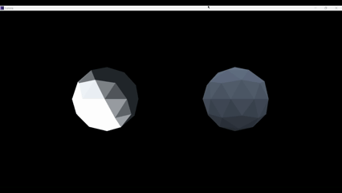

# Lunora

Lunora is a lightweight graphics engine developed for rendering research and experimental graphics studies.
It provides a minimal yet complete rendering pipeline designed to explore real-time rendering techniques without the architectural complexity of large-scale production engines.

### Research Experiments

#### Hemispheric Ambient Lighting vs. Standard Ambient Lighting

A comparative study examining visual and physical differences between hemispheric ambient lighting and standard ambient lighting across different geometries.

https://youtu.be/mM5tJjGJvMU

#### Water Rendering (Waves, Storm Dynamics, BRDF)

(Not completed ...)

### Core Engine Features 

- Real-time 3D mesh loading and rendering

- Modular shader system 

- Dynamic window resizing and viewport updates

- Basic lighting models 

- 24-bit and 32-bit TGA file support

- Texture mapping and sampling

### References and Acknowledgements

#### Engine Architecture and DirectX Foundations

- Real-Time 3D Rendering with DirectX and HLSL 

- Practical Rendering and Computation with Direct3D 11 

- Introduction to DirectX11 - Frank D. Luna 

- Game Engine Architecture

- Real Time Rendering

- https://www.rastertek.com/tutdx11win10.html

- https://www.youtube.com/watch?v=l9e8PJskYnI&list=PLv8Ddw9K0JPg1BEO-RS-0MYs423cvLVtj&index=11 

#### Hemishperic Ambient Light 

- HLSL Development Cookbook

#### Water Rendering (Wave, Storms, BRDF)

- https://developer.nvidia.com/gpugems/gpugems/part-i-natural-effects/chapter-1-effective-water-simulation-physical-models

- https://en.wikipedia.org/wiki/Trochoidal_wave